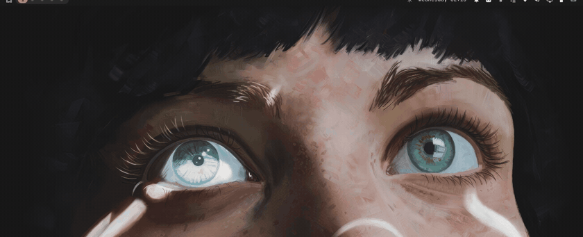
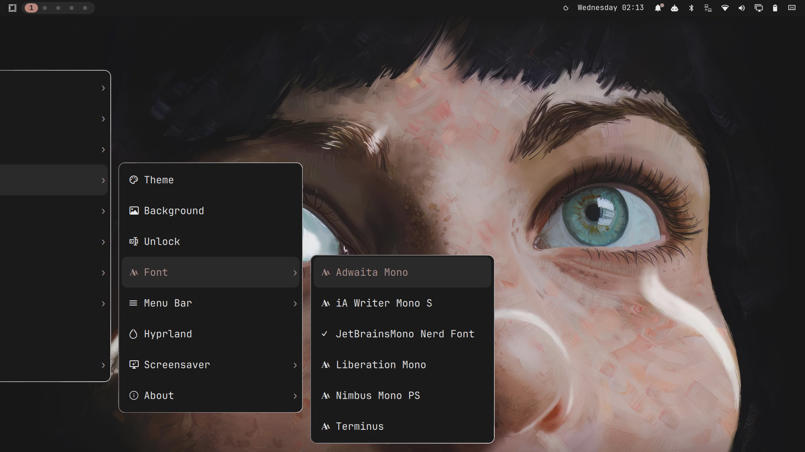

# Glide menus

The whole Omarchy menu as a keyboard-first cascading menu with clean,
centered motion. A fork of
[Cantina's context menus](https://github.com/cantinalabs/omarchy-context-menus)
that keeps its menu model — a verbatim copy of Omarchy's own `MenuModel.js`
reading `omarchy-menu.jsonc` plus your user extension, so entries, `when:`
guards and ✓ marks never drift from the built-in menu — and reworks the
interaction around a centered, animated cascade.



## What it does

- **Centered cascade.** The pane you are using always sits mid-screen, so
  your eyes never travel. Descending slides the whole chain one slot left
  as a single animated motion; ancestors stay visible as the path you took,
  the oldest walking off the edge. Walking back slides everything right
  again, and the closed pane glides away instead of vanishing.
- **Ghost preview.** When the selection rests on a submenu row, an opaque,
  muted preview of that submenu appears to the right — exactly where the
  real pane materializes when you press Right or Enter, chevrons, app
  icons and all.
- **Gliding selection.** The highlight is a pill that slides between rows,
  its leading edge faster than its trailing edge, the same motion family as
  [glide-workspaces](https://github.com/iryzhkov/omarchy-glide-workspaces).
- **Search everything.** Typing searches the entire subtree under the pane
  — apps inside Apps, submenus by name, actions in any branch — with muted
  breadcrumbs (`Style › Theme`) on results from deeper branches. Provider
  submenus (Apps, fonts) preload on the first keystroke.
- **Shortlists, not scrolling.** Provider-filled submenus show their top
  entries in the provider's own ranking (12 by default) with a
  "type to search N more" hint row, instead of hundreds of rows.
- **Navigation memory.** Descending parks the pane's filter and selection;
  walking back restores both — you land on the row you left, with the
  search you had typed.
- Escape closes the whole cascade; Left, Backspace (on an empty filter),
  and right-click walk back one pane. Hover selection is off by default
  and available as a setting.

Three levels deep — the active pane stays centered, ancestors trail off
the left edge, and the fonts shortlist ends in a search hint:



## Install

```
omarchy plugin add https://github.com/iryzhkov/omarchy-glide-menus.git --enable
```

Enabling replaces the built-in menu (`clonedFrom: omarchy.menu`); disabling
restores it. Summon with the bar button, a desktop right-click, or bind a
key:

```lua
hl.unbind("SUPER + SPACE")
o.bind("SUPER + SPACE", "Menu", "omarchy-shell glideMenu toggle")
```

## Settings

Edit in the bar's widget settings, or `omarchy bar set omarchy.menu <key>
<value>` while the plugin stands in for the built-in menu button.

| Key | Default | Meaning |
|-----|---------|---------|
| `layoutStyle` | `centered` | `centered` keeps the active pane mid-screen; `anchored` is the original grow-from-the-summon-point cascade. |
| `animations` | `true` | Slides, glides, and ghosts. Off restores instant behavior. |
| `hoverSelects` | `false` | Pointer hover moves the selection and opens submenus after a dwell. |
| `escClosesAll` | `true` | Escape dismisses the whole cascade instead of walking back one pane. |
| `appsShown` | `12` | Shortlist length for provider submenus; `0` shows everything and scrolls. |
| `summonPlacement` | `center` | Anchored layout only: keybinding summons open mid-screen or under the pointer. |
| `paneWidth` | `300` | Pane width in shell spacing units. |
| `submenuDelay` | `140` | Hover dwell before a submenu opens (with `hoverSelects`). |
| `desktopRightClick` | `true` | Right-click on bare desktop opens the menu at the click. |
| `wallpaperDoubleClick` | `true` | Double-click on the desktop still opens the wallpaper picker. |
| `inlineApps` | `true` | Fill the Apps submenu from the launcher's app library. |
| `rightClickCommand` | `xdg-terminal-exec` | What a right-click on the bar button runs. |

## Remove

```
omarchy plugin remove io.github.iryzhkov.glide-menus
```

## Notes

- No external dependencies, services, or privileged steps: pure QML on the
  APIs the Omarchy shell ships. Menu content, guard evaluation, and
  provider scripts are the built-in menu's own.
- MIT licensed; the original context-menus code is © Cantina, also MIT.
